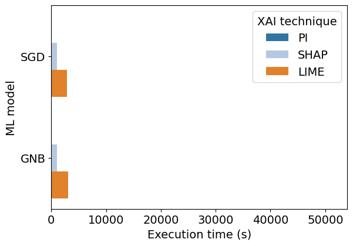
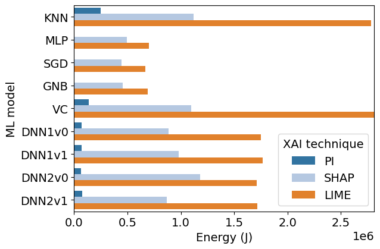
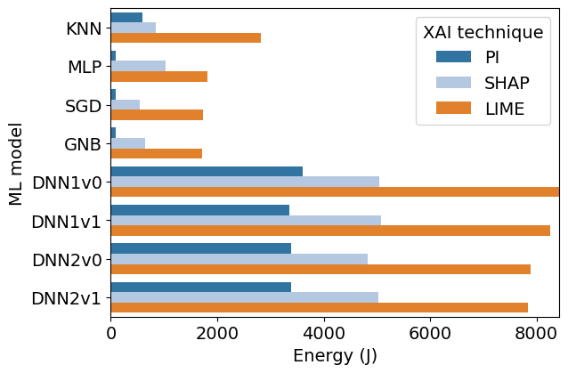
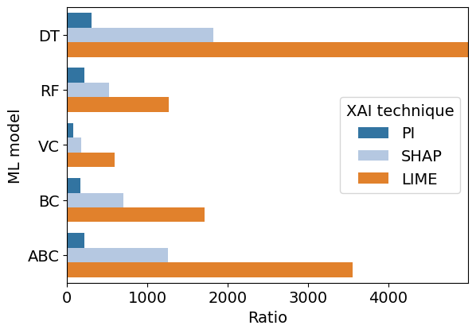
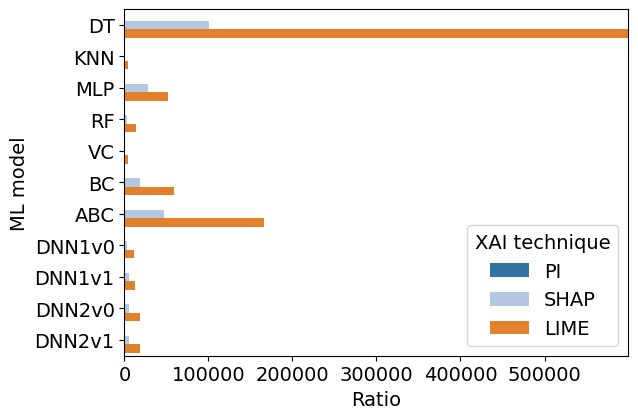
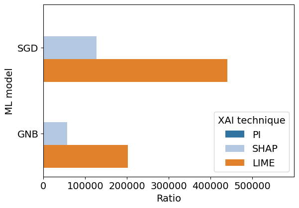

## Execution time figures

### Execution times of XAI techniques with QoS-QoE dataset and high-performance models

### Execution times of XAI techniques with QoS-QoE dataset and low-performance models

### Execution times of XAI techniques with UNAC dataset and high-performance models

### Execution times of XAI techniques with UNAC dataset and low-performance models

### Execution times of XAI techniques with 5G Slicing dataset and high-performance models

### Execution times of XAI techniques with 5G Slicing dataset and low-performance models

## Energy consumption figures

### Energy consumption of XAI techniques with QoS-QoE dataset and high-performance models

### Energy consumption of XAI techniques with QoS-QoE dataset and low-performance models

### Energy consumption of XAI techniques with UNAC dataset and high-performance models

### Energy consumption of XAI techniques with UNAC dataset and low-performance models

### Energy consumption of XAI techniques with 5G Slicing dataset and high-performance models

### Energy consumption of XAI techniques with 5G Slicing dataset and low-performance models

## Energy consumption ratio figures

### Energy consumption ratio of XAI techniques with QoS-QoE dataset and high-performance models

### Energy consumption ratio of XAI techniques with QoS-QoE dataset and low-performance models

### Energy consumption ratio of XAI techniques with UNAC dataset and high-performance models

### Energy consumption ratio of XAI techniques with UNAC dataset and low-performance models

### Energy consumption ratio of XAI techniques with 5G Slicing dataset and high-performance models

### Energy consumption ratio of XAI techniques with 5G Slicing dataset and low-performance models

## Correlation between features relevance

### Correlation between features relevance regarding datasets with high-performance models

### Correlation between features relevance regarding datasets with low-performance models

### Correlation between features relevance regarding models with high-performance models

### Correlation between features relevance regarding models with low-performance models

