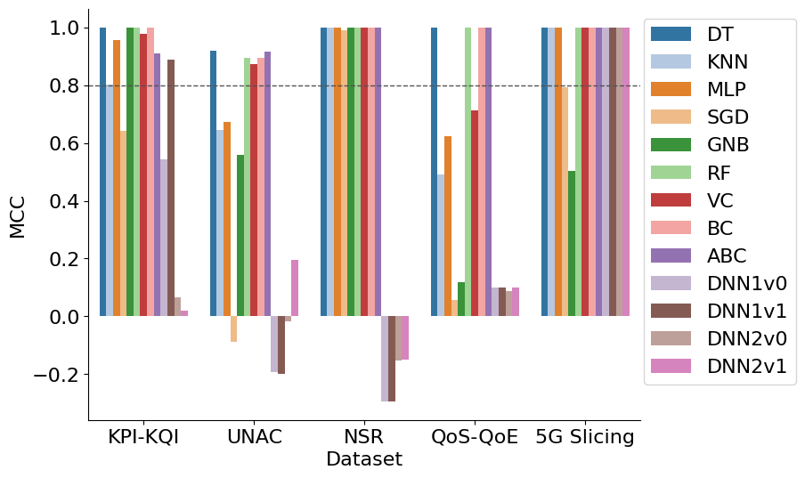
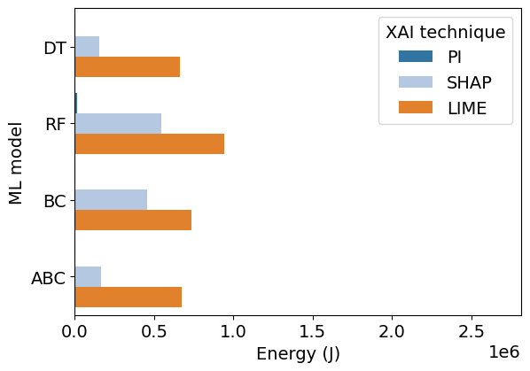
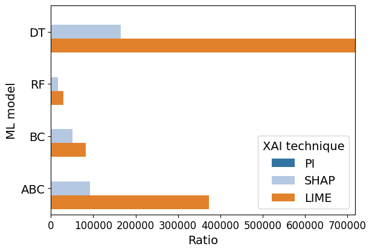
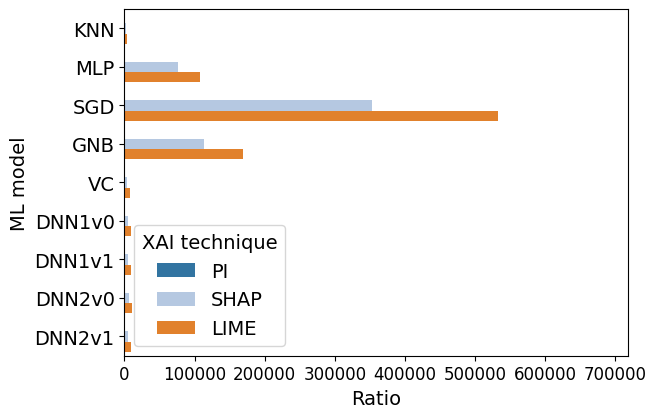
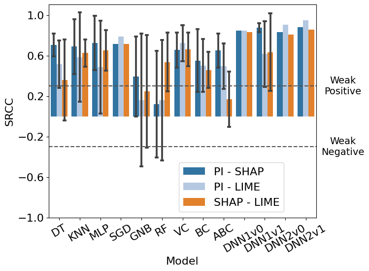
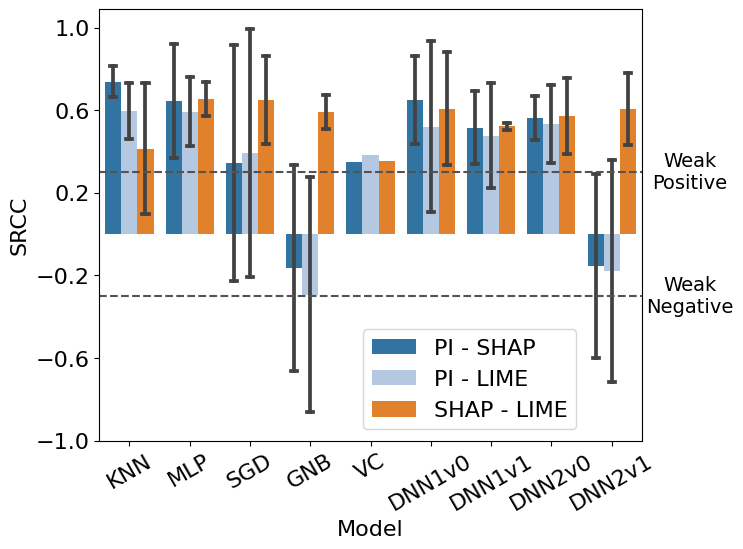

## Model performance figure

## Execution time figures

### Execution times of XAI techniques with KPI-KQI dataset and high-performance models

### Execution times of XAI techniques with KPI-KQI dataset and low-performance models

### Execution times of XAI techniques with UNAC dataset and high-performance models

### Execution times of XAI techniques with UNAC dataset and low-performance models

### Execution times of XAI techniques with NSR dataset and high-performance models

### Execution times of XAI techniques with NSR dataset and low-performance models

### Execution times of XAI techniques with QoS-QoE dataset and high-performance models

### Execution times of XAI techniques with QoS-QoE dataset and low-performance models

### Execution times of XAI techniques with 5G Slicing dataset and high-performance models

### Execution times of XAI techniques with 5G Slicing dataset and low-performance models

## Energy consumption figures

### Energy consumption of XAI techniques with KPI-KQI dataset and high-performance models

### Energy consumption of XAI techniques with KPI-KQI dataset and low-performance models

### Energy consumption of XAI techniques with UNAC dataset and high-performance models

### Energy consumption of XAI techniques with UNAC dataset and low-performance models

### Energy consumption of XAI techniques with NSR dataset and high-performance models

### Energy consumption of XAI techniques with NSR dataset and low-performance models

### Energy consumption of XAI techniques with QoS-QoE dataset and high-performance models

### Energy consumption of XAI techniques with QoS-QoE dataset and low-performance models

### Energy consumption of XAI techniques with 5G Slicing dataset and high-performance models

### Energy consumption of XAI techniques with 5G Slicing dataset and low-performance models

## Energy consumption ratio figures

### Energy consumption ratio of XAI techniques with KPI-KQI dataset and high-performance models

### Energy consumption ratio of XAI techniques with KPI-KQI dataset and low-performance models

### Energy consumption ratio of XAI techniques with UNAC dataset and high-performance models

### Energy consumption ratio of XAI techniques with UNAC dataset and low-performance models

### Energy consumption ratio of XAI techniques with NSR dataset and high-performance models

### Energy consumption ratio of XAI techniques with NSR dataset and low-performance models

### Energy consumption ratio of XAI techniques with QoS-QoE dataset and high-performance models

### Energy consumption ratio of XAI techniques with QoS-QoE dataset and low-performance models

### Energy consumption ratio of XAI techniques with 5G Slicing dataset and high-performance models

### Energy consumption ratio of XAI techniques with 5G Slicing dataset and low-performance models

## Correlation between features relevance

### Correlation between features relevance regarding datasets with high-performance models

### Correlation between features relevance regarding datasets with low-performance models

### Correlation between features relevance regarding models with high-performance models

### Correlation between features relevance regarding models with low-performance models

## Ratio Tables

Dataset: KPI-KQI

| ML model   |   Inference Energy (J) | XAI technique   |   XAI Energy (J) |   Ratio |
|:-----------|-----------------------:|:----------------|-----------------:|--------:|
| DT         |                   1.36 | PI              |           217.52 |  160.36 |
| DT         |                   1.36 | SHAP            |           866.92 |  639.12 |
| DT         |                   1.36 | LIME            |          2397.53 | 1767.53 |
| KNN        |                   8.62 | PI              |           899.54 |  104.37 |
| KNN        |                   8.62 | SHAP            |          3721.49 |  431.80 |
| KNN        |                   8.62 | LIME            |          3640.87 |  422.44 |
| MLP        |                   1.17 | PI              |           244.32 |  207.95 |
| MLP        |                   1.17 | SHAP            |          1793.43 | 1526.40 |
| MLP        |                   1.17 | LIME            |          2831.79 | 2410.15 |
| SGD        |                   1.15 | PI              |           232.36 |  201.28 |
| SGD        |                   1.15 | SHAP            |           904.69 |  783.66 |
| SGD        |                   1.15 | LIME            |          2488.01 | 2155.14 |
| GNB        |                   2.20 | PI              |           260.59 |  118.42 |
| GNB        |                   2.20 | SHAP            |           957.63 |  435.17 |
| GNB        |                   2.20 | LIME            |          2830.32 | 1286.17 |
| RF         |                   6.49 | PI              |           858.84 |  132.29 |
| RF         |                   6.49 | SHAP            |          1490.35 |  229.56 |
| RF         |                   6.49 | LIME            |          4379.70 |  674.60 |
| VC         |                   4.65 | PI              |           995.72 |  214.02 |
| VC         |                   4.65 | SHAP            |          1129.90 |  242.86 |
| VC         |                   4.65 | LIME            |          3749.69 |  805.95 |
| BC         |                   2.68 | PI              |           424.80 |  158.50 |
| BC         |                   2.68 | SHAP            |          1069.99 |  399.24 |
| BC         |                   2.68 | LIME            |          2752.45 | 1027.00 |
| ABC        |                   1.90 | PI              |           240.26 |  126.45 |
| ABC        |                   1.90 | SHAP            |           931.53 |  490.28 |
| ABC        |                   1.90 | LIME            |          2536.33 | 1334.93 |
| DNN1v0     |                 116.65 | PI              |          8278.98 |   70.97 |
| DNN1v0     |                 116.65 | SHAP            |          8267.63 |   70.88 |
| DNN1v0     |                 116.65 | LIME            |         16457.24 |  141.09 |
| DNN1v1     |                  90.14 | PI              |          8320.53 |   92.31 |
| DNN1v1     |                  90.14 | SHAP            |          8477.43 |   94.05 |
| DNN1v1     |                  90.14 | LIME            |         16382.43 |  181.75 |
| DNN2v0     |                  95.23 | PI              |          8925.00 |   93.72 |
| DNN2v0     |                  95.23 | SHAP            |          8578.73 |   90.09 |
| DNN2v0     |                  95.23 | LIME            |         16365.80 |  171.86 |
| DNN2v1     |                  97.22 | PI              |          8329.63 |   85.68 |
| DNN2v1     |                  97.22 | SHAP            |          8580.67 |   88.26 |
| DNN2v1     |                  97.22 | LIME            |         16279.15 |  167.45 |

Dataset: UNAC

| ML model   |   Inference Energy (J) | XAI technique   |   XAI Energy (J) |   Ratio |
|:-----------|-----------------------:|:----------------|-----------------:|--------:|
| DT         |                   0.31 | PI              |            91.95 |  300.78 |
| DT         |                   0.31 | SHAP            |           558.17 | 1825.76 |
| DT         |                   0.31 | LIME            |          1526.71 | 4993.82 |
| KNN        |                   5.80 | PI              |           593.36 |  102.30 |
| KNN        |                   5.80 | SHAP            |           841.77 |  145.13 |
| KNN        |                   5.80 | LIME            |          2813.75 |  485.11 |
| MLP        |                   0.58 | PI              |            99.02 |  170.19 |
| MLP        |                   0.58 | SHAP            |          1033.36 | 1776.12 |
| MLP        |                   0.58 | LIME            |          1813.08 | 3116.29 |
| SGD        |                   0.41 | PI              |            91.29 |  222.98 |
| SGD        |                   0.41 | SHAP            |           545.25 | 1331.74 |
| SGD        |                   0.41 | LIME            |          1732.51 | 4231.58 |
| GNB        |                   0.46 | PI              |            90.12 |  194.04 |
| GNB        |                   0.46 | SHAP            |           644.74 | 1388.12 |
| GNB        |                   0.46 | LIME            |          1715.05 | 3692.50 |
| RF         |                   2.31 | PI              |           490.00 |  212.19 |
| RF         |                   2.31 | SHAP            |          1212.48 |  525.04 |
| RF         |                   2.31 | LIME            |          2928.81 | 1268.28 |
| VC         |                   4.74 | PI              |           343.91 |   72.60 |
| VC         |                   4.74 | SHAP            |           825.57 |  174.29 |
| VC         |                   4.74 | LIME            |          2787.26 |  588.42 |
| BC         |                   1.03 | PI              |           171.22 |  166.09 |
| BC         |                   1.03 | SHAP            |           719.71 |  698.16 |
| BC         |                   1.03 | LIME            |          1762.42 | 1709.64 |
| ABC        |                   0.48 | PI              |           104.99 |  217.87 |
| ABC        |                   0.48 | SHAP            |           607.56 | 1260.79 |
| ABC        |                   0.48 | LIME            |          1715.67 | 3560.34 |
| DNN1v0     |                  28.46 | PI              |          3601.39 |  126.54 |
| DNN1v0     |                  28.46 | SHAP            |          5037.65 |  177.00 |
| DNN1v0     |                  28.46 | LIME            |          8426.08 |  296.05 |
| DNN1v1     |                  27.48 | PI              |          3354.99 |  122.08 |
| DNN1v1     |                  27.48 | SHAP            |          5073.80 |  184.62 |
| DNN1v1     |                  27.48 | LIME            |          8250.37 |  300.21 |
| DNN2v0     |                  26.06 | PI              |          3384.47 |  129.87 |
| DNN2v0     |                  26.06 | SHAP            |          4821.14 |  184.99 |
| DNN2v0     |                  26.06 | LIME            |          7883.94 |  302.52 |
| DNN2v1     |                  23.92 | PI              |          3392.01 |  141.79 |
| DNN2v1     |                  23.92 | SHAP            |          5023.92 |  210.01 |
| DNN2v1     |                  23.92 | LIME            |          7831.01 |  327.35 |

Dataset: NSR

| ML model   |   Inference Energy (J) | XAI technique   |   XAI Energy (J) |     Ratio |
|:-----------|-----------------------:|:----------------|-----------------:|----------:|
| DT         |                   2.06 | PI              |           477.78 |    232.37 |
| DT         |                   2.06 | SHAP            |        164159.55 |  79839.65 |
| DT         |                   2.06 | LIME            |        445502.81 | 216672.06 |
| KNN        |                 823.97 | PI              |        117518.58 |    142.63 |
| KNN        |                 823.97 | SHAP            |        568130.63 |    689.50 |
| KNN        |                 823.97 | LIME            |       2989078.92 |   3627.66 |
| MLP        |                  21.61 | PI              |          2931.50 |    135.66 |
| MLP        |                  21.61 | SHAP            |        339375.52 |  15704.97 |
| MLP        |                  21.61 | LIME            |        501707.24 |  23217.05 |
| SGD        |                   3.69 | PI              |          1084.63 |    294.21 |
| SGD        |                   3.69 | SHAP            |        172086.28 |  46679.64 |
| SGD        |                   3.69 | LIME            |        449756.37 | 121999.64 |
| GNB        |                   3.24 | PI              |           669.63 |    206.40 |
| GNB        |                   3.24 | SHAP            |        174574.57 |  53809.06 |
| GNB        |                   3.24 | LIME            |        471297.98 | 145268.02 |
| RF         |                  27.85 | PI              |          4478.63 |    160.82 |
| RF         |                  27.85 | SHAP            |        271967.82 |   9766.21 |
| RF         |                  27.85 | LIME            |        709627.47 |  25482.32 |
| VC         |                 343.09 | PI              |         66558.12 |    193.99 |
| VC         |                 343.09 | SHAP            |        565757.68 |   1648.98 |
| VC         |                 343.09 | LIME            |       3009573.69 |   8771.85 |
| BC         |                   8.87 | PI              |          1215.95 |    137.15 |
| BC         |                   8.87 | SHAP            |        195751.63 |  22078.87 |
| BC         |                   8.87 | LIME            |        516897.52 |  58300.97 |
| ABC        |                   2.90 | PI              |           617.19 |    212.88 |
| ABC        |                   2.90 | SHAP            |        166793.87 |  57530.36 |
| ABC        |                   2.90 | LIME            |        462934.85 | 159675.00 |
| DNN1v0     |                 421.61 | PI              |         58770.59 |    139.40 |
| DNN1v0     |                 421.61 | SHAP            |       1685055.00 |   3996.73 |
| DNN1v0     |                 421.61 | LIME            |       3090798.99 |   7330.97 |
| DNN1v1     |                 410.74 | PI              |         61916.27 |    150.74 |
| DNN1v1     |                 410.74 | SHAP            |       1695304.63 |   4127.47 |
| DNN1v1     |                 410.74 | LIME            |       3129274.35 |   7618.68 |
| DNN2v0     |                 450.92 | PI              |         59321.60 |    131.56 |
| DNN2v0     |                 450.92 | SHAP            |       1693677.51 |   3756.05 |
| DNN2v0     |                 450.92 | LIME            |       3113157.39 |   6904.01 |
| DNN2v1     |                 410.35 | PI              |         60576.05 |    147.62 |
| DNN2v1     |                 410.35 | SHAP            |       1704133.94 |   4152.84 |
| DNN2v1     |                 410.35 | LIME            |       3120148.22 |   7603.55 |

Dataset: QoS-QoE

| ML model   |   Inference Energy (J) | XAI technique   |   XAI Energy (J) |     Ratio |
|:-----------|-----------------------:|:----------------|-----------------:|----------:|
| DT         |                   0.93 | PI              |           622.06 |    671.40 |
| DT         |                   0.93 | SHAP            |        153352.77 | 165516.35 |
| DT         |                   0.93 | LIME            |        665296.73 | 718066.46 |
| KNN        |                 698.80 | PI              |        246288.34 |    352.45 |
| KNN        |                 698.80 | SHAP            |       1121603.34 |   1605.05 |
| KNN        |                 698.80 | LIME            |       2783313.93 |   3983.01 |
| MLP        |                   6.51 | PI              |          3441.10 |    528.90 |
| MLP        |                   6.51 | SHAP            |        494225.72 |  75963.50 |
| MLP        |                   6.51 | LIME            |        699824.93 | 107564.52 |
| SGD        |                   1.26 | PI              |          1517.39 |   1208.43 |
| SGD        |                   1.26 | SHAP            |        442574.81 | 352459.16 |
| SGD        |                   1.26 | LIME            |        667893.39 | 531899.11 |
| GNB        |                   4.05 | PI              |          2201.07 |    542.91 |
| GNB        |                   4.05 | SHAP            |        458056.32 | 112982.33 |
| GNB        |                   4.05 | LIME            |        687600.46 | 169600.77 |
| RF         |                  31.84 | PI              |         14640.28 |    459.75 |
| RF         |                  31.84 | SHAP            |        547579.22 |  17195.79 |
| RF         |                  31.84 | LIME            |        939355.00 |  29498.84 |
| VC         |                 359.49 | PI              |        138761.09 |    386.00 |
| VC         |                 359.49 | SHAP            |       1099971.47 |   3059.84 |
| VC         |                 359.49 | LIME            |       2812644.74 |   7824.06 |
| BC         |                   9.01 | PI              |          4563.02 |    506.41 |
| BC         |                   9.01 | SHAP            |        455622.94 |  50565.78 |
| BC         |                   9.01 | LIME            |        737743.21 |  81875.95 |
| ABC        |                   1.80 | PI              |          1128.34 |    625.46 |
| ABC        |                   1.80 | SHAP            |        166705.28 |  92408.15 |
| ABC        |                   1.80 | LIME            |        673722.92 | 373458.41 |
| DNN1v0     |                 182.51 | PI              |         70273.19 |    385.04 |
| DNN1v0     |                 182.51 | SHAP            |        882920.85 |   4837.71 |
| DNN1v0     |                 182.51 | LIME            |       1753515.88 |   9607.88 |
| DNN1v1     |                 178.66 | PI              |         71180.17 |    398.41 |
| DNN1v1     |                 178.66 | SHAP            |        981891.07 |   5495.83 |
| DNN1v1     |                 178.66 | LIME            |       1765843.84 |   9883.76 |
| DNN2v0     |                 163.86 | PI              |         65241.85 |    398.15 |
| DNN2v0     |                 163.86 | SHAP            |       1180877.64 |   7206.55 |
| DNN2v0     |                 163.86 | LIME            |       1714081.17 |  10460.54 |
| DNN2v1     |                 181.96 | PI              |         73617.94 |    404.59 |
| DNN2v1     |                 181.96 | SHAP            |        867089.76 |   4765.36 |
| DNN2v1     |                 181.96 | LIME            |       1720062.45 |   9453.14 |

Dataset: 5G Slicing

| ML model   |   Inference Energy (J) | XAI technique   |   XAI Energy (J) |     Ratio |
|:-----------|-----------------------:|:----------------|-----------------:|----------:|
| DT         |                   2.25 | PI              |           273.06 |    121.59 |
| DT         |                   2.25 | SHAP            |        224838.92 | 100122.74 |
| DT         |                   2.25 | LIME            |       1346343.89 | 599538.75 |
| KNN        |                3234.12 | PI              |        185997.18 |     57.51 |
| KNN        |                3234.12 | SHAP            |       2495993.60 |    771.77 |
| KNN        |                2338.79 | LIME            |       8907823.13 |   3808.74 |
| MLP        |                  22.87 | PI              |          2126.69 |     92.97 |
| MLP        |                  22.87 | SHAP            |        638992.27 |  27934.33 |
| MLP        |                  22.87 | LIME            |       1191348.61 |  52081.26 |
| SGD        |                   2.32 | PI              |           674.52 |    291.10 |
| SGD        |                   2.32 | SHAP            |        294518.90 | 127103.41 |
| SGD        |                   2.32 | LIME            |       1018579.28 | 439580.97 |
| GNB        |                   5.34 | PI              |           647.17 |    121.08 |
| GNB        |                   5.34 | SHAP            |        302479.00 |  56592.89 |
| GNB        |                   5.34 | LIME            |       1079477.45 | 201966.91 |
| RF         |                 221.72 | PI              |         17302.62 |     78.04 |
| RF         |                 221.72 | SHAP            |        805924.23 |   3634.92 |
| RF         |                 221.72 | LIME            |       2956054.81 |  13332.54 |
| VC         |                3021.74 | PI              |        190329.91 |     62.99 |
| VC         |                3021.74 | SHAP            |       2578997.70 |    853.48 |
| VC         |                3021.74 | LIME            |      13526962.91 |   4476.54 |
| BC         |                  21.45 | PI              |          1949.36 |     90.87 |
| BC         |                  21.45 | SHAP            |        402267.30 |  18752.30 |
| BC         |                  21.45 | LIME            |       1272543.83 |  59321.57 |
| ABC        |                   6.56 | PI              |           686.10 |    104.64 |
| ABC        |                   6.56 | SHAP            |        307512.14 |  46898.40 |
| ABC        |                   6.56 | LIME            |       1091032.45 | 166392.38 |
| DNN1v0     |                1120.85 | PI              |         80358.73 |     71.69 |
| DNN1v0     |                1120.85 | SHAP            |       3876210.30 |   3458.27 |
| DNN1v0     |                1120.85 | LIME            |      12541060.28 |  11188.84 |
| DNN1v1     |                 927.94 | PI              |         69830.68 |     75.25 |
| DNN1v1     |                 927.94 | SHAP            |       4780662.65 |   5151.90 |
| DNN1v1     |                 927.94 | LIME            |      11432220.96 |  12319.97 |
| DNN2v0     |                 936.46 | PI              |         68479.21 |     73.13 |
| DNN2v0     |                 936.46 | SHAP            |       4738082.07 |   5059.56 |
| DNN2v0     |                 936.46 | LIME            |      16843226.56 |  17986.04 |
| DNN2v1     |                 924.75 | PI              |         72267.59 |     78.15 |
| DNN2v1     |                 924.75 | SHAP            |       4763268.10 |   5150.89 |
| DNN2v1     |                 924.75 | LIME            |      17170913.57 |  18568.24 |