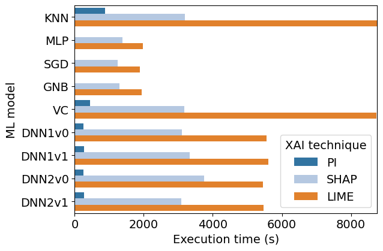

## Execution time figures

### Execution times of XAI techniques with QoS-QoE dataset and high-performance models

### Execution times of XAI techniques with QoS-QoE dataset and low-performance models

### Execution times of XAI techniques with UNAC dataset and high-performance models

### Execution times of XAI techniques with UNAC dataset and low-performance models

### Execution times of XAI techniques with 5G Slicing dataset and high-performance models

### Execution times of XAI techniques with 5G Slicing dataset and low-performance models

## Energy consumption figures

### Energy consumption of XAI techniques with QoS-QoE dataset and high-performance models

### Energy consumption of XAI techniques with QoS-QoE dataset and low-performance models

### Energy consumption of XAI techniques with UNAC dataset and high-performance models

### Energy consumption of XAI techniques with UNAC dataset and low-performance models

### Energy consumption of XAI techniques with 5G Slicing dataset and high-performance models

### Energy consumption of XAI techniques with 5G Slicing dataset and low-performance models

## Energy consumption ratio figures

### Energy consumption ratio of XAI techniques with QoS-QoE dataset and high-performance models

### Energy consumption ratio of XAI techniques with QoS-QoE dataset and low-performance models

### Energy consumption ratio of XAI techniques with UNAC dataset and high-performance models

### Energy consumption ratio of XAI techniques with UNAC dataset and low-performance models

### Energy consumption ratio of XAI techniques with 5G Slicing dataset and high-performance models

### Energy consumption ratio of XAI techniques with 5G Slicing dataset and low-performance models

## Correlation between features relevance

### Correlation between features relevance regarding datasets with high-performance models

### Correlation between features relevance regarding datasets with low-performance models

### Correlation between features relevance regarding models with high-performance models

### Correlation between features relevance regarding models with low-performance models

## Ratio Tables

Dataset: QoS-QoE

| ML model   |   Inference Energy (J) | XAI technique   |   XAI Energy (J) |      Ratio |
|:-----------|-----------------------:|:----------------|-----------------:|-----------:|
| DT         |                4.55976 | PI              |   3061.4         |    671.395 |
| DT         |                4.55976 | SHAP            | 754715           | 165516     |
| DT         |                4.55976 | LIME            |      3.27421e+06 | 718066     |
| KNN        |             3439.08    | PI              |      1.21209e+06 |    352.446 |
| KNN        |             3439.08    | SHAP            |      5.51989e+06 |   1605.05  |
| KNN        |             3439.08    | LIME            |      1.36979e+07 |   3983.01  |
| MLP        |               32.0193  | PI              |  16935.2         |    528.905 |
| MLP        |               32.0193  | SHAP            |      2.756e+06   |  86073.2   |
| MLP        |               32.0193  | LIME            |      3.44414e+06 | 107565     |
| SGD        |                6.17972 | PI              |   7467.75        |   1208.43  |
| SGD        |                6.17972 | SHAP            |      2.33493e+06 | 377836     |
| SGD        |                6.17972 | LIME            |      3.28699e+06 | 531899     |
| GNB        |               19.9526  | PI              |  10832.4         |    542.907 |
| GNB        |               19.9526  | SHAP            |      2.40124e+06 | 120347     |
| GNB        |               19.9526  | LIME            |      3.38398e+06 | 169601     |
| RF         |              156.717   | PI              |  72051.1         |    459.753 |
| RF         |              156.717   | SHAP            |      2.87404e+06 |  18339.1   |
| RF         |              156.717   | LIME            |      4.62297e+06 |  29498.8   |
| VC         |             1769.19    | PI              | 682903           |    385.998 |
| VC         |             1769.19    | SHAP            |      5.41343e+06 |   3059.84  |
| VC         |             1769.19    | LIME            |      1.38422e+07 |   7824.06  |
| BC         |               44.3445  | PI              |  22456.6         |    506.411 |
| BC         |               44.3445  | SHAP            |      2.45336e+06 |  55324.9   |
| BC         |               44.3445  | LIME            |      3.63075e+06 |  81876     |
| ABC        |                8.87831 | PI              |   5553.06        |    625.463 |
| ABC        |                8.87831 | SHAP            | 820428           |  92408.2   |
| ABC        |                8.87831 | LIME            |      3.31568e+06 | 373458     |
| DNN1v0     |              898.2     | PI              | 345844           |    385.042 |
| DNN1v0     |              898.2     | SHAP            |      4.34523e+06 |   4837.71  |
| DNN1v0     |              898.2     | LIME            |      8.6298e+06  |   9607.88  |
| DNN1v1     |              879.268   | PI              | 350308           |    398.409 |
| DNN1v1     |              879.268   | SHAP            |      4.83231e+06 |   5495.83  |
| DNN1v1     |              879.268   | LIME            |      8.69047e+06 |   9883.76  |
| DNN2v0     |              806.433   | PI              | 321083           |    398.152 |
| DNN2v0     |              806.433   | SHAP            |      5.8116e+06  |   7206.55  |
| DNN2v0     |              806.433   | LIME            |      8.43573e+06 |  10460.5   |
| DNN2v1     |              895.487   | PI              | 362305           |    404.59  |
| DNN2v1     |              895.487   | SHAP            |      4.26732e+06 |   4765.36  |
| DNN2v1     |              895.487   | LIME            |      8.46516e+06 |   9453.14  |

Dataset: UNAC

| ML model   |   Inference Energy (J) | XAI technique   |   XAI Energy (J) |     Ratio |
|:-----------|-----------------------:|:----------------|-----------------:|----------:|
| DT         |                1.50458 | PI              |          452.549 |  300.782  |
| DT         |                1.50458 | SHAP            |         2747     | 1825.76   |
| DT         |                1.50458 | LIME            |         7513.59  | 4993.82   |
| KNN        |               28.5456  | PI              |         2920.2   |  102.3    |
| KNN        |               28.5456  | SHAP            |         4142.69  |  145.126  |
| KNN        |               28.5456  | LIME            |        13847.7   |  485.108  |
| MLP        |                2.86333 | PI              |          487.308 |  170.189  |
| MLP        |                2.86333 | SHAP            |         5085.61  | 1776.12   |
| MLP        |                2.86333 | LIME            |         8922.97  | 3116.29   |
| SGD        |                2.01495 | PI              |          449.292 |  222.979  |
| SGD        |                2.01495 | SHAP            |         2683.39  | 1331.74   |
| SGD        |                2.01495 | LIME            |         8526.44  | 4231.58   |
| GNB        |                2.28585 | PI              |          443.535 |  194.035  |
| GNB        |                2.28585 | SHAP            |         3173.02  | 1388.12   |
| GNB        |                2.28585 | LIME            |         8440.49  | 3692.5    |
| RF         |               11.365   | PI              |         2411.5   |  212.187  |
| RF         |               11.365   | SHAP            |         5967.12  |  525.045  |
| RF         |               11.365   | LIME            |        14413.9   | 1268.28   |
| VC         |               23.3121  | PI              |         1692.51  |   72.6023 |
| VC         |               23.3121  | SHAP            |         4062.97  |  174.286  |
| VC         |               23.3121  | LIME            |        13717.3   |  588.419  |
| BC         |                5.07336 | PI              |          842.656 |  166.094  |
| BC         |                5.07336 | SHAP            |         3542.02  |  698.161  |
| BC         |                5.07336 | LIME            |         8673.62  | 1709.64   |
| ABC        |                2.37155 | PI              |          516.685 |  217.868  |
| ABC        |                2.37155 | SHAP            |         2990.04  | 1260.79   |
| ABC        |                2.37155 | LIME            |         8443.54  | 3560.34   |
| DNN1v0     |              140.071   | PI              |        17724     |  126.536  |
| DNN1v0     |              140.071   | SHAP            |        24792.4   |  177      |
| DNN1v0     |              140.071   | LIME            |        41468.3   |  296.053  |
| DNN1v1     |              135.25    | PI              |        16511.4   |  122.08   |
| DNN1v1     |              135.25    | SHAP            |        24970.3   |  184.624  |
| DNN1v1     |              135.25    | LIME            |        40603.6   |  300.212  |
| DNN2v0     |              128.258   | PI              |        16656.4   |  129.867  |
| DNN2v0     |              128.258   | SHAP            |        23726.9   |  184.994  |
| DNN2v0     |              128.258   | LIME            |        38800.3   |  302.518  |
| DNN2v1     |              117.734   | PI              |        16693.5   |  141.79   |
| DNN2v1     |              117.734   | SHAP            |        24724.8   |  210.006  |
| DNN2v1     |              117.734   | LIME            |        38539.8   |  327.346  |

Dataset: 5G Slicing

| ML model   |   Inference Energy (J) | XAI technique   |   XAI Energy (J) |        Ratio |
|:-----------|-----------------------:|:----------------|-----------------:|-------------:|
| DT         |                27.4007 | PI              |   3331.79        |    121.595   |
| DT         |                27.4007 | SHAP            |      2.74344e+06 | 100123       |
| DT         |                27.4007 | LIME            |      1.64558e+07 | 600562       |
| KNN        |             39486.7    | PI              |      2.2695e+06  |     57.475   |
| KNN        |             39486.7    | SHAP            |      3.04556e+07 |    771.287   |
| KNN        |             28537.4    | LIME            |      1.08691e+08 |   3808.74    |
| MLP        |               112.577  | PI              |  10466.3         |     92.9707  |
| MLP        |               112.577  | SHAP            |      3.1606e+06  |  28075.1     |
| MLP        |               112.577  | LIME            |      5.89406e+06 |  52355.9     |
| SGD        |                11.4037 | PI              |   3319.59        |    291.097   |
| SGD        |                11.4037 | SHAP            |      1.44945e+06 | 127103       |
| SGD        |                11.4037 | LIME            |      5.04057e+06 | 442010       |
| GNB        |                26.4293 | PI              |   3195.14        |    120.894   |
| GNB        |                26.4293 | SHAP            |      1.48863e+06 |  56324.9     |
| GNB        |                26.4293 | LIME            |      5.34448e+06 | 202218       |
| RF         |              1093.28   | PI              |  85153.6         |     77.8882  |
| RF         |              1093.28   | SHAP            |      3.9663e+06  |   3627.89    |
| RF         |              1093.28   | LIME            |      1.46364e+07 |  13387.6     |
| VC         |             14871.3    | PI              | 936695           |     62.9868  |
| VC         |             14871.3    | SHAP            |      1.26924e+07 |    853.48    |
| VC         |             14871.3    | LIME            |      6.6572e+07  |   4476.54    |
| BC         |               105.573  | PI              |   9593.64        |     90.8724  |
| BC         |               105.573  | SHAP            |      1.97973e+06 |  18752.3     |
| BC         |               105.573  | LIME            |      6.29886e+06 |  59663.8     |
| ABC        |                32.4427 | PI              |   3389.84        |    104.487   |
| ABC        |                32.4427 | SHAP            |      1.5134e+06  |  46648.3     |
| ABC        |                32.4427 | LIME            |      5.40322e+06 | 166546       |
| DNN1v0     |             13676.4    | PI              |  80358.7         |      5.87571 |
| DNN1v0     |             13676.4    | SHAP            |      3.87621e+06 |    283.423   |
| DNN1v0     |             13676.4    | LIME            |      1.25411e+07 |    916.984   |
| DNN1v1     |              4566.8    | PI              |  69830.7         |     15.2909  |
| DNN1v1     |              4566.8    | SHAP            |      4.78066e+06 |   1046.83    |
| DNN1v1     |              4566.8    | LIME            |      1.14322e+07 |   2503.33    |
| DNN2v0     |              4608.73   | PI              |  68479.2         |     14.8586  |
| DNN2v0     |              4608.73   | SHAP            |      4.73808e+06 |   1028.07    |
| DNN2v0     |              4608.73   | LIME            |      1.68432e+07 |   3654.64    |
| DNN2v1     |              4551.07   | PI              |  72267.6         |     15.8792  |
| DNN2v1     |              4551.07   | SHAP            |      4.76327e+06 |   1046.62    |
| DNN2v1     |              1529.08   | LIME            |      1.71709e+07 |  11229.6     |         |      1.71709e+07 |  11229.6     |